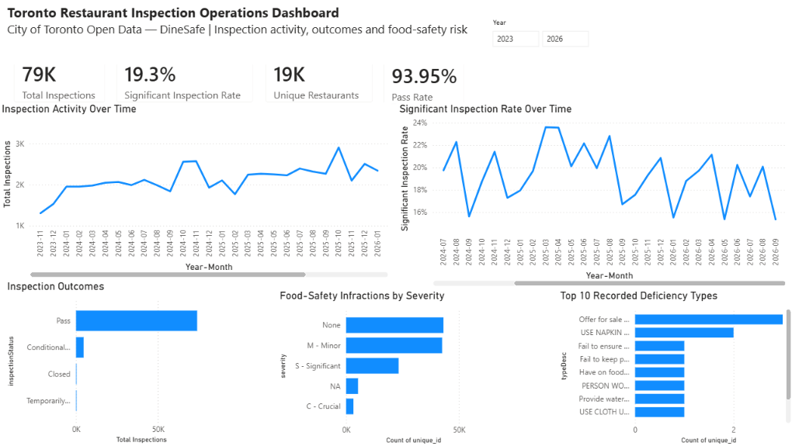

# Toronto DineSafe Restaurant Inspection Dashboard

A Power BI dashboard analysing restaurant inspection activity, outcomes, food-safety infractions, and risk trends in Toronto.

## Project objective

To turn City of Toronto DineSafe open data into an interactive dashboard that helps users understand inspection patterns, pass rates, significant infractions, and the most common deficiency types.

## Dashboard features

- Key performance indicators for total inspections, significant inspection rate, unique restaurants, and pass rate
- Monthly inspection activity trend
- Monthly significant-inspection-rate trend
- Inspection outcomes comparison
- Food-safety infractions by severity
- Top recorded deficiency types
- Year filter for focused analysis
- Inspection-details page with restaurant records and a map of significant and crucial infractions

## Data source

City of Toronto Open Data — [DineSafe](https://open.toronto.ca/dataset/dinesafe/)

The dataset includes restaurant details, inspection dates, outcomes, deficiencies, severity levels, and geographic coordinates.

## Tools used

- Power BI Desktop
- Power Query for data preparation
- DAX measures for dashboard KPIs and rates
- Data visualisation and interactive filtering

## Files

- `Toronto_Restaurant_Inspection_Operations_Dashboard.pbix` — interactive Power BI dashboard
- `dinesafe-dashboard-preview.png` — dashboard preview image

## Notes

This is an independent portfolio project created for learning and demonstration. The raw dataset is not included in this repository; it remains available through the official City of Toronto Open Data portal.
